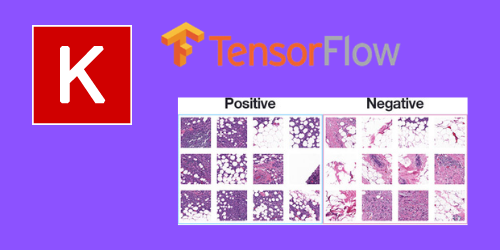

<h1 align="center">
  
</h1>

<h1 align="center">Aplicando uma Rede neural convolucional no Dataset Breast Cancer</h1>

Um modelo simplificado de CNN (Rede Neural Convolutional) para ser aplicado no Dataset Breast Cancer, Esse modelo tem por finalidade entender como uma Rede Neural Convolutional funciona e quais os principais parametros utilizados para a modelagem de um modelo de Machine Learning

<h4 align="center"> 
	🚧 🚀 Em construção...  🚧
</h4>

